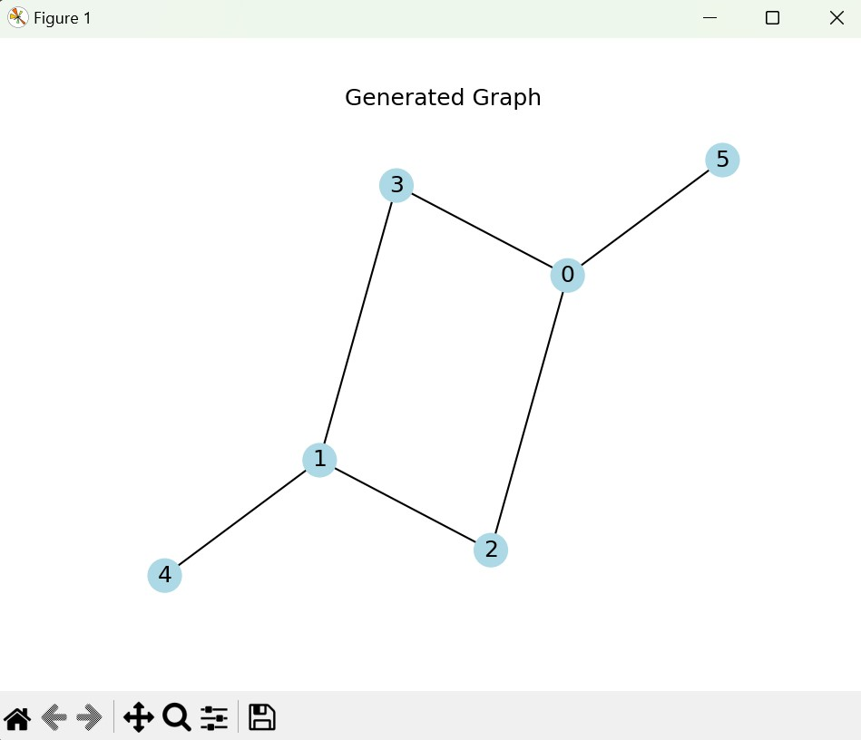
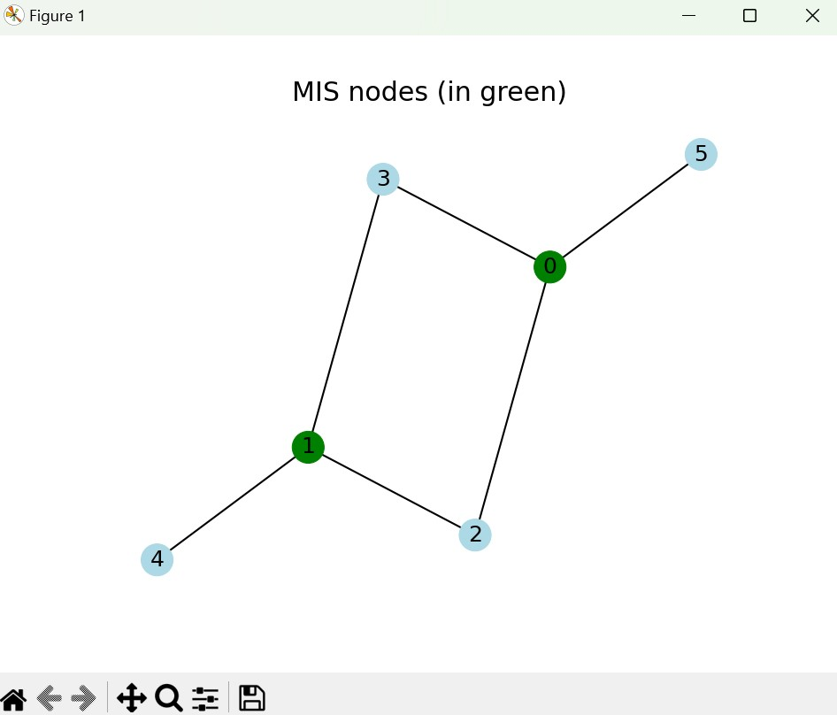

# QSOF Task 4: QAOA Solver for Maximum Independent Set Problem

This project implements a solver for the Maximum Independent Set (MIS) problem using the Quantum Approximate Optimization Algorithm (QAOA). The QAOA algorithm is a variational quantum algorithm designed to find approximate solutions to combinatorial optimization problems.

## Overview

The `main.py` script initializes and runs the QAOA solver based on the configurations specified in the `config.yml` file. It uses PennyLane, a Python library for quantum machine learning, to construct and optimize quantum circuits.

## Usage

- **Installation**: 
    ```bash
    pip install -r requirements.txt
    ```

- **Configuration**: Modify the `config.yml` file to specify the parameters for the QAOA solver. The configuration file includes settings such as the number of nodes, edge probabilities, QAOA type, layer depth, and simulator.

- **Running the Solver**: Execute the `main.py` script to run the QAOA solver. It reads the configuration from `config.yml`, initializes the solver, solves the MIS problem, and visualizes the results.
    ```python 
    python main.py
    ```

- **Visualization**: If specified in the configuration, the solver can draw the generated graph and highlight the nodes in the maximum independent set.

## Files

- `main.py`: Main script to run the QAOA solver based on configurations.
- `config.yml`: Configuration file specifying parameters for the QAOA solver.
- `utils`: Directory containing utility files.
- `task_4`: Directory containing the QAOA solver implementation.

## Configurations

Modify the `config.yml` file to customize the QAOA solver parameters:

```yaml
# nx graph variables
NUM_NODES: 6          # Number of nodes in the graph
EDGES_PROBS: 0.4      # Probability of edge creation
SEED: 42              # Seed for random graph generation
DRAW_GRAPH: true      # Whether to draw the generated graph

# QAOA variables
QAOA_TYPE: "GATE-BASED"    # Type of QAOA, either "GATE-BASED" or "ADIABATIC"
QAOA_LAYER_DEPTH: 2         # Depth of QAOA layers
STEPS: 50                    # Number of optimization steps
SIMULATOR: "qulacs.simulator"   # Quantum simulator to use
QAOA_LAYER_PARAMS:          # Initial parameters for QAOA layers
  - 0.5
  - 0.5
  - 0.5
  - 0.5

# Other configs
LOGS_FILE: "logs/logs.csv"  # File to save optimization logs
```

## Example run with the above configuration

### Parameters in the logs/logs.csv file

```csv
,Timestamp,Step,0,1,2,3
0,2024-04-02 12:42:04.890732,0,0.5,0.5,0.5,0.5
1,2024-04-02 12:42:08.035435,1,0.510357034006244,0.5026059698392799,0.5092093259846123,0.5155158580791361
2,2024-04-02 12:42:11.121357,2,0.5219116902346801,0.5052501968634507,0.5194176998351191,0.5326101938158814
...
49,2024-04-02 12:45:14.162457,49,1.0385060622326487,0.4491793110810756,0.9830669810401744,1.0036347209165255
50,2024-04-02 12:45:17.143242,50,1.0432470900121016,0.4465094734265604,0.9891128922752848,1.0018932429733522

```

## QAOA in action

Generated Graph | Probability Distribution | After Solving the QAOA
:-------------:|:-------------:|:-------------:
 |  | 

## Author

## Author

Shubham Kaushal
Email: kaushalshubham.ks@gmail.com
GitHub: [Shubham Kaushal](https://github.com/shubhamkaushal765)
