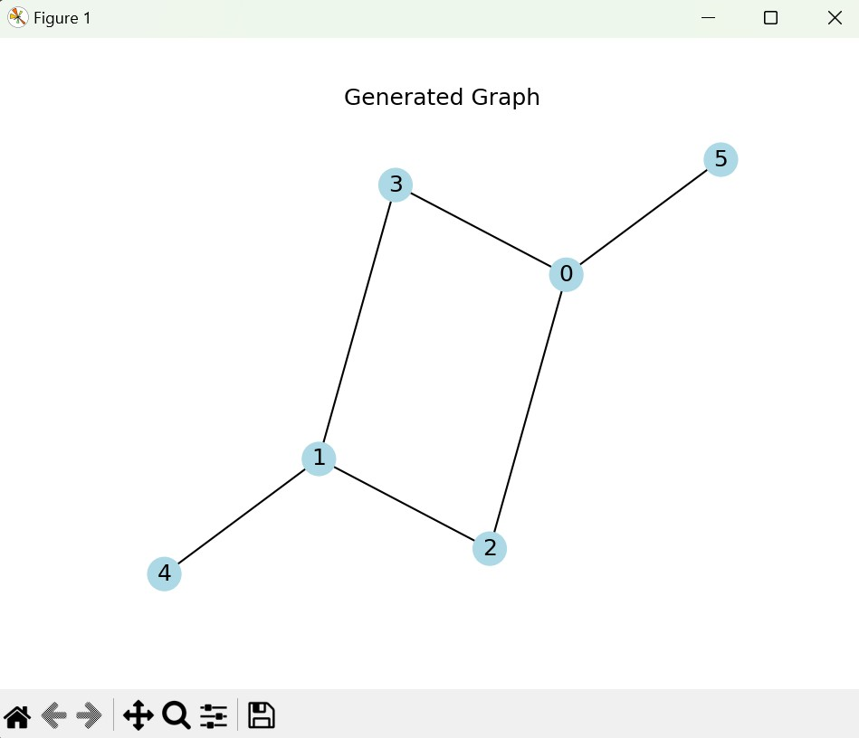
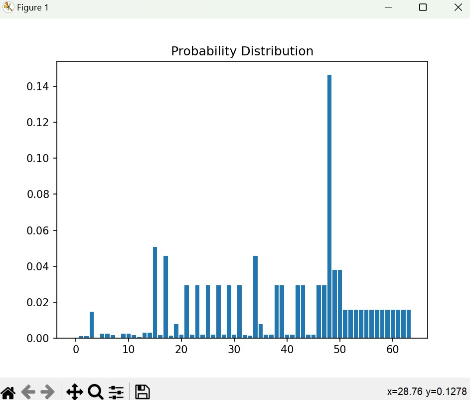
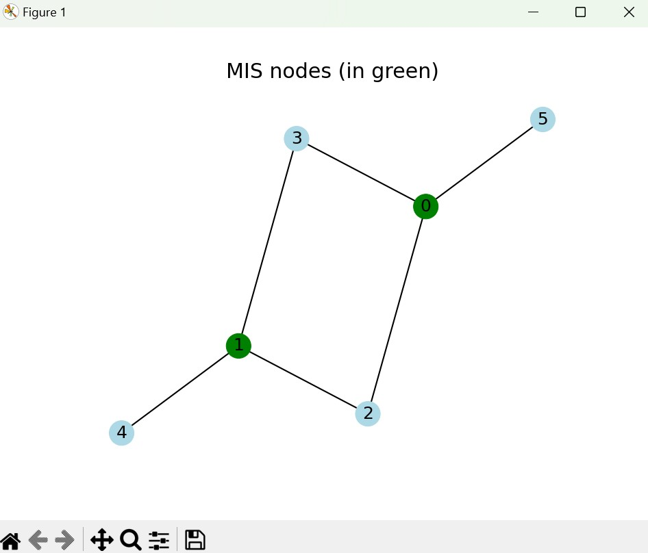
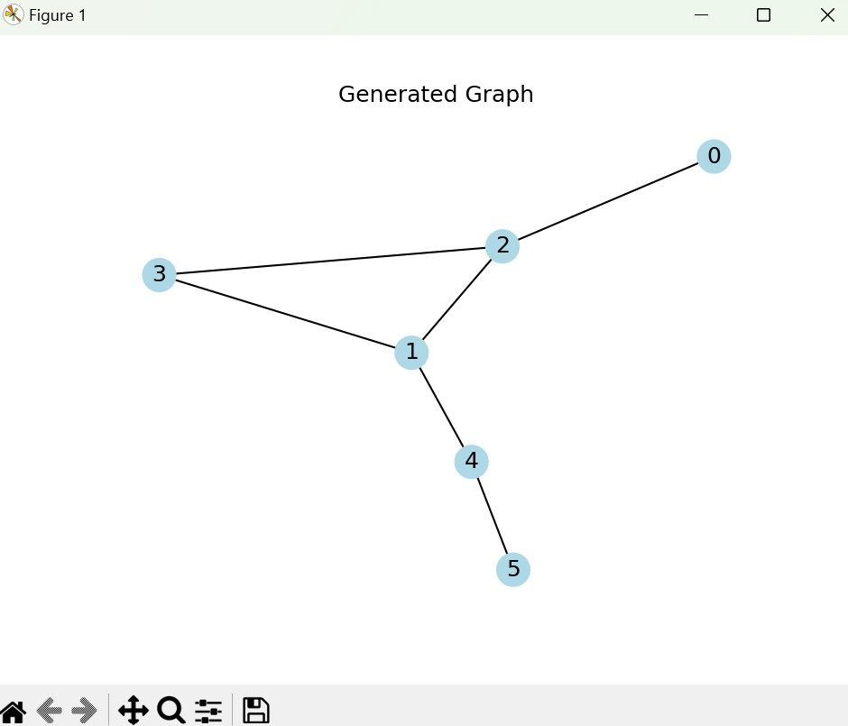
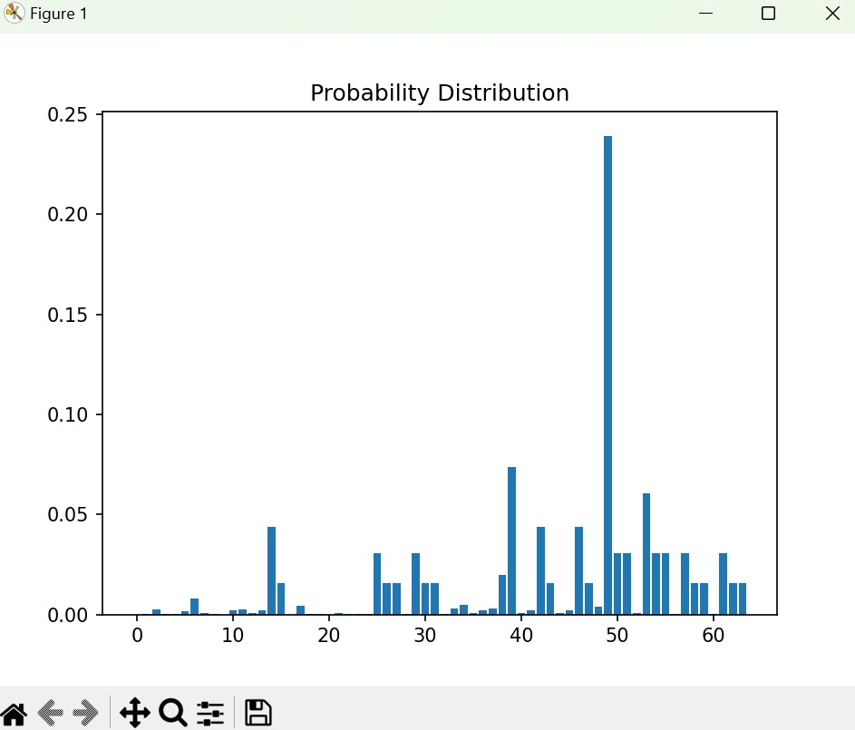
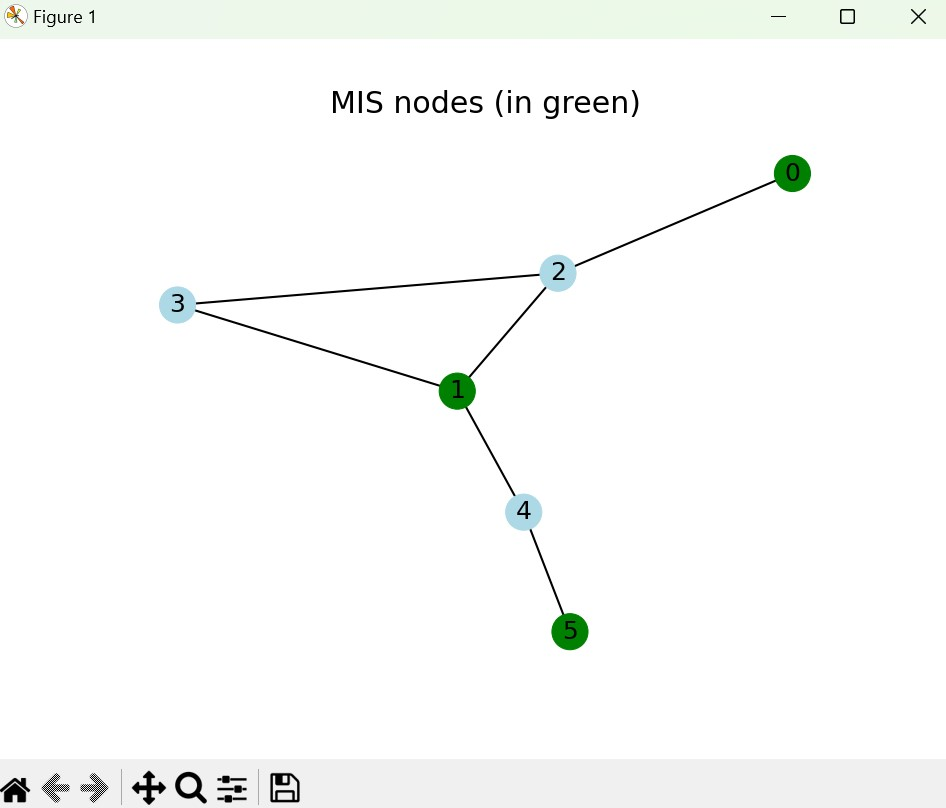

# QOSF Task 4: Solving Maximum Independent Set Problem using QAOA and Quantum Adiabatic Algorithm <!-- omit from toc -->

> For details on the implementation, see [task_4/README.md](task_4/README.md)

## Table of Contents <!-- omit from toc -->
- [Overview](#overview)
  - [QAOA Algorithm](#qaoa-algorithm)
  - [Quantum Adiabatic Algorithm](#quantum-adiabatic-algorithm)
- [QAOA in action on Random Graphs](#qaoa-in-action-on-random-graphs)
  - [`Nodes=6, Edge Probs=0.4, Seed=42`](#nodes6-edge-probs04-seed42)
  - [`Nodes=6, Edge Probs=0.4, Seed=50`](#nodes6-edge-probs04-seed50)
- [Usage](#usage)
- [Files](#files)
- [Configurations](#configurations)
- [Example run with the above configuration](#example-run-with-the-above-configuration)
  - [Parameters in the logs/logs.csv file](#parameters-in-the-logslogscsv-file)
- [Other Resources](#other-resources)
- [Author](#author)

## Overview

This project implements a solver for the Maximum Independent Set (MIS) problem using the Quantum Approximate Optimization Algorithm (QAOA) and the Quantum Adiabatic Algorithm. 

### QAOA Algorithm
The Quantum Approximate Optimization Algorithm (QAOA) is a hybrid quantum-classical algorithm for solving combinatorial optimization problems. It works by encoding the problem into a cost Hamiltonian and applying alternating layers of cost and mixer Hamiltonians to a quantum state.

### Quantum Adiabatic Algorithm

The adiabatic quantum algorithm used in this implementation is based on the principles of quantum annealing. It involves evolving the quantum system from an easily solvable initial state to the desired final state by slowly changing the Hamiltonian of the system.


## QAOA in action on Random Graphs

### `Nodes=6, Edge Probs=0.4, Seed=42`

|       Generated Graph        |  Probability Distribution   |      After Solving the QAOA      |
| :--------------------------: | :-------------------------: | :------------------------------: |
|  |  |  |

### `Nodes=6, Edge Probs=0.4, Seed=50`

|       Generated Graph        |  Probability Distribution   |      After Solving the QAOA      |
| :--------------------------: | :-------------------------: | :------------------------------: |
|  |  |  |


## Usage

- **Installation**: 
    ```bash
    pip install -r requirements.txt
    ```

- **Configuration**: Modify the `config.yml` file to specify the parameters for the QAOA solver. The configuration file includes settings such as the number of nodes, edge probabilities, QAOA type, layer depth, and simulator.

- **Running the Solver**: Execute the `main.py` script to run the QAOA solver. It reads the configuration from `config.yml`, initializes the solver, solves the MIS problem, and visualizes the results.
    ```python 
    python main.py
    ```

- **Visualization**: If specified in the configuration, the solver can draw the generated graph and highlight the nodes in the maximum independent set.

## Files

- `main.py`: Main script to run the QAOA solver based on configurations.
- `config.yml`: Configuration file specifying parameters for the QAOA solver.
- `utils`: Directory containing utility files.
- `task_4`: Directory containing the QAOA solver implementation.

## Configurations

Modify the `config.yml` file to customize the QAOA solver parameters:

```yaml
# Global variables
DRAW_PLOTS: true      # Whether to draw the generated graph
NUM_NODES: 5          # Number of nodes in the graph, for both QAOA and Adiabatic solvers
SOLVERS: "both"       # one of ["QAOA", "Adiabatic", "both"], determines which solver to run

# QAOA variables
QAOA_VARS:
    RANDOM_GRAPH: true          # Whether to generate random graphs. If true, then global NUM_NODES is overridden
    NUM_NODES: 6                # Number of nodes in the graph. Only works if RANDOM_GRAPH is true.
    EDGE_PROBS: 0.4             # Probability of edge creation. Only works if RANDOM_GRAPH is true.
    SEED: 42                    # Seed for random graph generation. Only works if RANDOM_GRAPH is true.
    
    QAOA_LAYER_DEPTH: 2         # Depth of QAOA layers
    STEPS: 50                   # Number of optimization steps
    SIMULATOR: "qulacs.simulator"   # Quantum simulator to use
    QAOA_LAYER_PARAMS:          # Initial parameters for QAOA layers
      - 0.5
      - 0.5
      - 0.5
      - 0.5

    # Other configs
    LOG_FILE: "logs/logs_r.csv"  # File to save optimization logs

# Adiabatic Variables
ADIABATIC_VARS:
    DISTANCE_MULTIPLIER: 8    # A multiplier for the node coordinates
    RABI_FREQUENCY: 1         # Rabi frequency
    DELTA_0: -5               # Initial detuning (must be negative)
    DELTA_F: 5                # Final detuning (must be positive)
    TOTAL_TIME: 4000          # Total time (in mu-sec)
```

## Example run with the above configuration

### Parameters in the logs/logs.csv file

```csv
,Timestamp,Step,0,1,2,3
0,2024-04-02 12:42:04.890732,0,0.5,0.5,0.5,0.5
1,2024-04-02 12:42:08.035435,1,0.510357034006244,0.5026059698392799,0.5092093259846123,0.5155158580791361
2,2024-04-02 12:42:11.121357,2,0.5219116902346801,0.5052501968634507,0.5194176998351191,0.5326101938158814
...
49,2024-04-02 12:45:14.162457,49,1.0385060622326487,0.4491793110810756,0.9830669810401744,1.0036347209165255
50,2024-04-02 12:45:17.143242,50,1.0432470900121016,0.4465094734265604,0.9891128922752848,1.0018932429733522

```

## Other Resources
<details>
<summary>Notes</summary>
- Generate requirements.txt

```bash
# create requirements.txt
python -m pipreqs.pipreqs --ignore _env_ --force
```
</details>

<details>
    <summary>Links & Resources</summary>
    <ul>
        <li>
            References from source: <a href=https://pulser.readthedocs.io/en/stable/index.html>Pulser</a>| <a href=https://queracomputing.github.io/Bloqade.jl/dev/>Bloqade</a>
        </li>
        <li><a href=https://en.wikipedia.org/wiki/Maximal_independent_set>Wikipedia - Maximal Independent Set</a></li>
        <li>
            <a href=https://www.quera.com/glossary/maximum-independent-set> QuEra - Maximum Independent Set</a>
        </li>
        <li>
            <a href=https://networkx.org/documentation/stable/reference/algorithms/generated/networkx.algorithms.mis.maximal_independent_set.html>NetworkX - Maximal Independent Set</a>
        </li>
        <li>
            <a href=https://ali-ibrahim137.github.io/competitive/programming/2020/01/02/maximum-independent-set-in-bipartite-graphs.html>GitHub page on Maximum Independent set in Bipartite Graphs</a>
        </li>
        <li>
            <a href=https://docs.classiq.io/latest/tutorials/applications/optimization/max-independent-set/max-independent-set/>Classiq - MIS</a>
        </li>
        <li>
        <a href=https://www.youtube.com/watch?v=csgEVurrBpU>Adiabatic Quantum Computing - Peter Wittek</a>
        </li>
    </ul>
</details>


## Author

Shubham Kaushal <br>
Email: kaushalshubham.ks@gmail.com <br>
[LinkedIn](https://www.linkedin.com/in/kaushalshubham/) | [GitHub](https://github.com/shubhamkaushal765)
