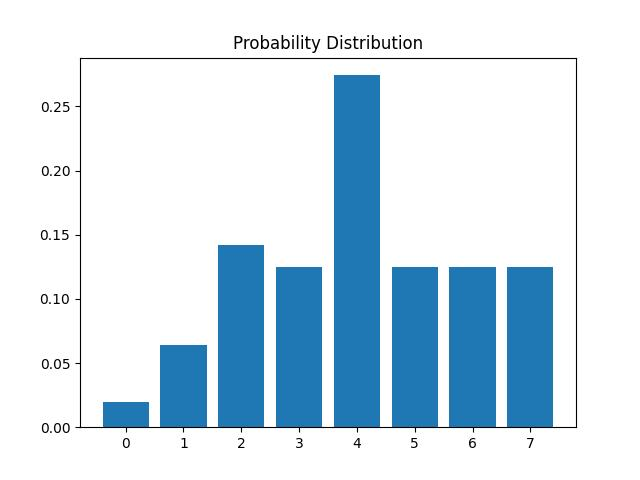

# QOSF Task 4: Solving Maximum Independent Set Problem using QAOA and Quantum Adiabatic Algorithm <!-- omit from toc -->

> For details on the implementation, see [task_4/README.md](task_4/README.md)

## Table of Contents <!-- omit from toc -->
- [Overview](#overview)
  - [QAOA Algorithm](#qaoa-algorithm)
  - [Quantum Adiabatic Algorithm](#quantum-adiabatic-algorithm)
- [Usage](#usage)
  - [Installation](#installation)
  - [Configuration](#configuration)
  - [Running `mis_solver.py`](#running-mis_solverpy)
  - [Visualizing the results](#visualizing-the-results)
- [Files](#files)
- [Both Solvers in Action](#both-solvers-in-action)
  - [Problem Definition](#problem-definition)
  - [QAOA Solution](#qaoa-solution)
  - [Adiabatic Solution](#adiabatic-solution)
    - [Adiabatic Paramaters for solving the MIS problem](#adiabatic-paramaters-for-solving-the-mis-problem)
- [QAOA in action on Random Graphs](#qaoa-in-action-on-random-graphs)
  - [`Nodes=6, Edge Probs=0.4, Seed=42`](#nodes6-edge-probs04-seed42)
  - [`Nodes=6, Edge Probs=0.4, Seed=50`](#nodes6-edge-probs04-seed50)
- [Observations and Conclusions](#observations-and-conclusions)
- [Future Work](#future-work)
- [Other Resources](#other-resources)
- [Author](#author)

## Overview

This project implements a solver for the Maximum Independent Set (MIS) problem using the Quantum Approximate Optimization Algorithm (QAOA) and the Quantum Adiabatic Algorithm. 

### QAOA Algorithm
The Quantum Approximate Optimization Algorithm (QAOA) is a hybrid quantum-classical algorithm for solving combinatorial optimization problems. It works by encoding the problem into a cost Hamiltonian and applying alternating layers of cost and mixer Hamiltonians to a quantum state.

### Quantum Adiabatic Algorithm

The adiabatic quantum algorithm used in this implementation is based on the principles of quantum annealing. It involves evolving the quantum system from an easily solvable initial state to the desired final state by slowly changing the Hamiltonian of the system.

## Usage

### Installation

```bash
pip install -r requirements.txt
```
- `scipy==1.12.0` is a hard dependency. Any other version of scipy does not work.
- To resolve any other dependency issue, uninstall `pulser` and install it again at last.

### Configuration

Modify the `config.yml` file to specify the parameters for the QAOA and the Adiabatic solver.

A sample configuration file:

```yaml
# Global variables
DRAW_PLOTS: true      # Whether to draw the generated graph
NUM_NODES: 3          # Number of nodes in the graph, for both QAOA and Adiabatic solvers
SOLVERS: "both"       # one of ["QAOA", "Adiabatic", "both"], determines which solver to run
PLOT_WAIT_TIME: 10     # time in seconds for which the plots stay on screen

# QAOA variables
QAOA_VARS:
    RANDOM_GRAPH: false         # Whether to generate random graphs. If true, then global NUM_NODES is overridden
    NUM_NODES: 6                # Number of nodes in the graph. Only works if RANDOM_GRAPH is true.
    EDGE_PROBS: 0.4             # Probability of edge creation. Only works if RANDOM_GRAPH is true.
    SEED: 42                    # Seed for random graph generation. Only works if RANDOM_GRAPH is true.
    
    QAOA_LAYER_DEPTH: 2         # Depth of QAOA layers
    STEPS: 50                   # Number of optimization steps
    SIMULATOR: "qulacs.simulator"   # Quantum simulator to use
    QAOA_LAYER_PARAMS:          # Initial parameters for QAOA layers
      - 0.5
      - 0.5
      - 0.5
      - 0.5

    # Other configs
    LOG_FILE: "logs/logs_3.csv"  # File to save optimization logs

# Adiabatic Variables
ADIABATIC_VARS:
    DISTANCE_MULTIPLIER: 8    # A multiplier for the node coordinates
    RABI_FREQUENCY: 1         # Rabi frequency
    DELTA_0: -5               # Initial detuning (must be negative)
    DELTA_F: 5                # Final detuning (must be positive)
    TOTAL_TIME: 4000          # Total time (in mu-sec)
```

### Running `mis_solver.py`

After setting the `config.yml`, execute the `mis_solver.py` to run the solvers by running the command:

```python
python mis_solver.py
```

### Visualizing the results

If specified in the configuration, the solver can draw the generated graph and highlight the nodes in the maximum independent set.

## Files

- `mis_solver.py`: Main script to run the QAOA and the Adiabatic solver based on configurations.
- `config.yml`: Configuration file specifying parameters for the solvers.
- `utils`: Directory containing utility files.
- `task_4`: Directory containing the QAOA and Adiabatic solver implementation.


## Both Solvers in Action

### Problem Definition

| Number of Nodes |   Generated Graph    | Neutral Atoms Arrangement |
| :-------------: | :------------------: | :-----------------------: |
|        3        |   |       |
|        5        |  |       |
|        6        |  |        |
|        7        |  |       |


### QAOA Solution

| Number of Nodes |  Probability Distribution   |    Most Probable Solution    |
| :-------------: | :-------------------------: | :--------------------------: |
|        3        |  |  |
|        5        |  |  |
|        6        |  |  |
|        7        |  |  |


### Adiabatic Solution

#### Adiabatic Paramaters for solving the MIS problem


| Number of Nodes | Probability Distribution |  Most Probable Solution  |
| :-------------: | :----------------------: | :----------------------: |
|        3        |     |  |
|        5        |     |  |
|        6        |     |  |
|        7        |     |  |


## QAOA in action on Random Graphs

### `Nodes=6, Edge Probs=0.4, Seed=42`

|       Generated Graph        |  Probability Distribution   |      After Solving the QAOA      |
| :--------------------------: | :-------------------------: | :------------------------------: |
|  |  |  |

### `Nodes=6, Edge Probs=0.4, Seed=50`

|       Generated Graph        |  Probability Distribution   |      After Solving the QAOA      |
| :--------------------------: | :-------------------------: | :------------------------------: |
|  |  |  |

## Observations and Conclusions

1. QAOA (Quantum Approximate Optimization Algorithm):
   - The QAOA is a variational quantum algorithm capable of solving the Maximum Independent Set (MIS) problem with reasonable accuracy for smaller graphs `(num_nodes = 3, 5, and 6)`.
   - However, for the case of `num_nodes = 7`, the algorithm guesses an incorrect solution, returning `{0, 2, 6}`, an independent solution instead of the correct MIS `{node4}`.
   - The performance of the QAOA algorithm may improve by adjusting circuit configurations, such as circuit depth, starting circuit parameters, and the number of steps.

2. QAA (Quantum Adiabatic Algorithm):
   - The QAA algorithm solves the MIS problem, but in most cases, it finds an Independent Set rather than the Maximum Independent Set.
   - The solution can be improved by modifying parameters like Rabi frequency, detuning parameters, and the total time for which the Hamiltonian is evolved.
   - Using different atom arrangements for the same graph may also lead to better solutions.

3. Challenges and Observations:
   - Finding a good arrangement of atoms is a challenge in the Adiabatic Algorithm. A good arrangement can potentially solve any problem using this algorithm.
   - When testing the QAOA solver on random graphs with `num_nodes = 6, edge_probs = 0.4, and seeds = 42 and 50`, the solver provides the correct solution with good probability.
   - The higher the number of edges in a graph, the more challenging it becomes to solve the MIS problem using the QAOA algorithm.

## Future Work

- Ablation study on the QAOA solver. Change the parameters (circuit_depth, circuit_params, mixer hamiltonian, steps, etc.) and see how the solution changes.
- Ablation study on the Adiabatic solver. Change the parameters (rabi frequency, detuning wave, atomic arrangement) and see how the solution changes.
- To check how increasing the number of nodes and edges change the fidelity of the algorithms.

The key aspects are conducting ablation studies by varying relevant parameters for both solvers, and evaluating their performance as problem sizes scale up. This can provide insights into parameter sensitivities, optimal configurations, and potential limitations of the algorithms.

## Other Resources
<details>
<summary>Notes</summary>
- Generate requirements.txt

```bash
# create requirements.txt
python -m pipreqs.pipreqs --ignore _env_ --force
```
</details>

<details>
    <summary>Links & Resources</summary>
    <ul>
        <li>
            References from source: <a href=https://pulser.readthedocs.io/en/stable/index.html>Pulser</a>| <a href=https://queracomputing.github.io/Bloqade.jl/dev/>Bloqade</a>
        </li>
        <li><a href=https://en.wikipedia.org/wiki/Maximal_independent_set>Wikipedia - Maximal Independent Set</a></li>
        <li>
            <a href=https://www.quera.com/glossary/maximum-independent-set> QuEra - Maximum Independent Set</a>
        </li>
        <li>
            <a href=https://networkx.org/documentation/stable/reference/algorithms/generated/networkx.algorithms.mis.maximal_independent_set.html>NetworkX - Maximal Independent Set</a>
        </li>
        <li>
            <a href=https://ali-ibrahim137.github.io/competitive/programming/2020/01/02/maximum-independent-set-in-bipartite-graphs.html>GitHub page on Maximum Independent set in Bipartite Graphs</a>
        </li>
        <li>
            <a href=https://docs.classiq.io/latest/tutorials/applications/optimization/max-independent-set/max-independent-set/>Classiq - MIS</a>
        </li>
        <li>
        <a href=https://www.youtube.com/watch?v=csgEVurrBpU>Adiabatic Quantum Computing - Peter Wittek</a>
        </li>
    </ul>
</details>


## Author

Shubham Kaushal <br>
Email: kaushalshubham.ks@gmail.com <br>
[LinkedIn](https://www.linkedin.com/in/kaushalshubham/) | [GitHub](https://github.com/shubhamkaushal765)
